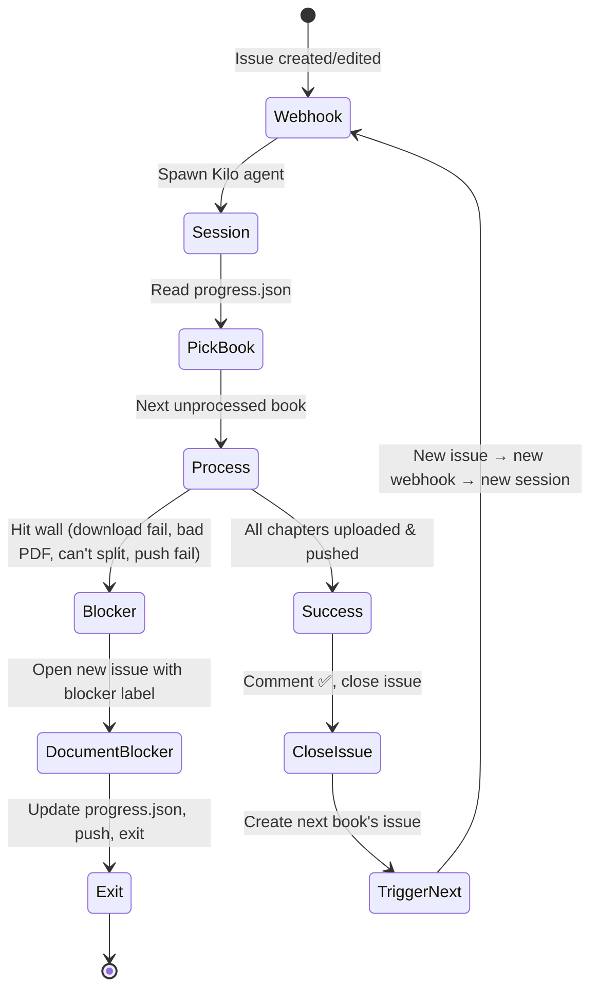

# STBB eBooks Processing — Self-Healing Issue-Driven Workflow

## Core Idea

**One webhook session = one book.** No infinite loops, no stuck scripts. Each session:
1. Picks the next unprocessed book from `book_list.json`
2. Processes it chapter-by-chapter (verified)
3. Commits & pushes each chapter
4. On **success**: closes its tracking issue, opens next book's issue
5. On **error/blocker**: documents it in the issue, closes with `blocked` label → next session picks up from there

The **GitHub Issue is the state machine** — no hidden session state, no global variables.

---

## Repository State (Source of Truth)

| File | Purpose |
|------|---------|
| `book_list.json` | Master catalog — all books by grade with STBB IDs |
| `progress.json` | `{ "processed": [...], "failed": [...], "blocked": [...] }` — append-only log |
| `README.md` | This guide |
| `jpegs_to_pdf.py` | Zero-dep JPEG → PDF converter |
| `Grade N/Subject/` | Chapter PDFs (output) |

**No other files.** Scripts that loop forever (`stbb_*.py`, `start_processing.sh`) are **deleted**.

---

## Webhook Trigger Contract

**Endpoint:** `POST /webhook/stbb-process` (Kilo GitHub webhook)

**Payload:** `{ "issue_number": 123 }` — the issue created by the previous session (or manual start)

**Session MUST:**
- Exit within **10 minutes** (hard timeout)
- Process **exactly one book**
- Leave repo in a consistent state (commits pushed, progress.json updated, issue commented)

---

## Session Flow (Pseudocode)

```python
def main(issue_number):
    issue = github.get_issue(issue_number)
    book = parse_book_from_issue(issue)  # {grade, subject, id, title}
    
    try:
        # 1. Download raw PDF (English medium only)
        raw_pdf = download_stbb_book(book['id'])
        
        # 2. Split into chapters (pdftoppm → find Unit boundaries)
        chapters = split_into_chapters(raw_pdf, book)
        
        # 3. For each chapter: flatten → verify → commit → push
        for ch in chapters:
            pdf_path = flatten_chapter(ch)           # pdftoppm + jpegs_to_pdf.py
            verify_pdf(pdf_path)                     # open, check pages, size
            git_commit_push(pdf_path, book, ch)      # one commit per chapter
            update_progress_json(book['id'], ch)     # append to progress.json
        
        # 4. SUCCESS — mark processed, close issue, open next
        mark_processed(book['id'])
        issue.comment(f"✅ Completed {book['title']} — {len(chapters)} chapters uploaded")
        issue.close()
        next_book = get_next_unprocessed_book()
        if next_book:
            github.create_issue(
                title=f"Process: {next_book['title']} (Grade {next_book['grade']})",
                body=issue_template(next_book),
                labels=["auto-trigger"]
            )
        
    except BlockerError as e:
        # 5. BLOCKER — document, label, close issue, DON'T retry
        issue.comment(f"🛑 BLOCKED: {e}\n\nNext session: see `progress.json` → `blocked`")
        issue.add_labels(["blocked", "needs-human"])
        issue.close()
        mark_blocked(book['id'], str(e))
    
    except Exception as e:
        # 6. UNEXPECTED ERROR — log, label, close
        issue.comment(f"❌ ERROR: {type(e).__name__}: {e}\n\nTraceback in workflow run.")
        issue.add_labels(["error", "needs-human"])
        issue.close()
        mark_failed(book['id'], str(e))

# Session ALWAYS exits here — no loops, no retries, no sleep.
```

---

## Issue Template (Auto-generated)

```markdown
<!-- AUTO-GENERATED — DO NOT EDIT MANUALLY -->
## Book: Biology IX (Grade 9)
**STBB ID:** 117 | **Grade:** 9 | **Subject:** Biology

### Status
- [ ] Raw PDF downloaded
- [ ] Chapters split (Unit boundaries identified)
- [ ] Chapter 1 uploaded
- [ ] Chapter 2 uploaded
- [ ] ... (one checkbox per chapter)
- [ ] `progress.json` updated

### Blocker Checklist (if stuck)
- [ ] STBB portal 404 / rate limited
- [ ] PDF corrupt / password protected
- [ ] Unit boundaries unclear
- [ ] `pdftoppm` / `jpegs_to_pdf.py` failed
- [ ] Git push rejected (permissions, size)
- [ ] Other: ______

### Handoff Notes
> Next session: continue from first unchecked chapter.
> If all chapters done but push failed → retry push only.
> If blocker → see `progress.json` → `blocked` array.
```

---

## Blocker Taxonomy (So Next Session Knows)

| Label | Meaning | Next Session Action |
|-------|---------|---------------------|
| `blocked:portal` | STBB site down / 404 / rate limit | Wait, retry download (exponential backoff) |
| `blocked:pdf` | Corrupt, password, weird structure | Human review needed — open manual issue |
| `blocked:split` | Can't find Unit boundaries | Human: open PDF, note page ranges |
| `blocked:tool` | `pdftoppm` / converter crash | Fix tool / use alternative |
| `blocked:git` | Push rejected (size, perms, LFS) | Split further / use LFS / check auth |
| `blocked:unknown` | Anything else | Human triage |

**Each blocker gets a unique issue** with the label — searchable, auditable.

---

## Progress.json Schema (Append-Only)

```json
{
  "processed": ["139", "39", "40", "104", "86", "140", ...],
  "failed": [
    {"id": "113", "title": "General Knowledge III", "grade": "3", "error": "HTTP 404", "timestamp": "2025-08-22T..."}
  ],
  "blocked": [
    {"id": "174", "title": "Physics IX", "grade": "9", "blocker": "blocked:portal", "detail": "STBB rate limit", "issue": 42, "timestamp": "2025-08-22T..."}
  ]
}
```

- **Never remove** from `processed` — it's an audit trail
- `blocked` entries reference the GitHub issue number
- Next session reads `progress.json` to know where to start

---

## Self-Healing Issue-Driven Loop

**This repo is designed for Kilo webhook sessions. Each session = one book = one exit.**

The GitHub Issue is the state machine. When a session gets stuck, it documents the blocker in the issue and exits. The next session reads the issue + `progress.json` and continues.

### The Loop



### Why This Gets Stuck If You Don't Follow It

| Anti-Pattern | What Happens | Fix |
|---|---|---|
| Processing all 22 books in one session | Runs 4+ hours, times out, no commits | **One book per session** |
| Looping on same book after blocker | Wastes hours, no progress | **Document blocker → exit → next session** |
| No issue created when stuck | Next session has no context | **Always open a labeled issue before exiting** |
| Hidden state in session memory | Lost on timeout/crash | **GitHub Issue + progress.json = state** |
| Chemistry X / bad chapter detection | Script extracts wrong titles, produces garbage | **Document exact page ranges, mark blocked:split** |

### Chemistry X Lesson (ID 198)

Chemistry X exposed a real edge case: chapter title pages don't have "Chapter N" markers on the first 3 units. The script will:
- Detect page 5 as a chapter start (it has "Time Allocation")
- Extract garbage titles like "1.3 Equilibrium constant..."
- Produce wrong chapter splits

**If chapter detection produces wrong titles or boundaries:**
1. **STOP** — do not commit bad chapters
2. **Open a blocker issue** with label `blocked:split`
3. **Document**: "Chemistry X — pages 5, 23, 37 are unit title pages without 'Chapter' markers. Need manual page-range mapping: [list pages]"
4. **Exit the session**

The next session (or human) will fix the detector or manually specify ranges.

### Blocker Issue Template

```markdown
**BLOCKED:** Grade {grade} {subject} (ID: {id})

**Blocker type:** `blocked:split` | `blocked:pdf` | `blocked:portal` | `blocked:tool` | `blocked:git`

**What happened:**
{exact error or issue}

**What was tried:**
{steps, page numbers inspected, commands run}

**What the next session needs:**
{explicit handoff — page ranges, fixed URL, tool version, etc.}
```

### Progress.json Update on Blocker

```json
{
  "blocked": [
    {
      "id": "198",
      "title": "Chemsitry X",
      "grade": "10",
      "subject": "Chemistry",
      "blocker": "blocked:split",
      "issue": 42,
      "detail": "Pages 5,23,37 have no Chapter marker; detector extracts wrong titles",
      "timestamp": "2026-08-23T02:00:00Z"
    }
  ]
}
```

### The Golden Rules

1. **One book per session** — hard stop after one book, success or failure
2. **No blind retries** — if a step fails twice, document and exit
3. **Issue before exit** — always leave a GitHub issue with status
4. **Chemistry X / bad detection → blocked:split** — don't commit garbage
5. **Exit is always success** — even a blocker issue is progress

---

## Kilo Cloud Agent: Sparse Checkout (No Full Repo Download)

```bash
# In webhook session startup (runs fresh each time):
git clone --filter=blob:none --sparse https://github.com/abdulahadattar/STBB-BOOKS.git
cd STBB-BOOKS
git sparse-checkout init --cone
git sparse-checkout set .  # only control files

# When processing Grade 10 Biology:
git sparse-checkout add "Grade 10/Biology"
# ... add chapter PDFs ...
git commit && git push
git sparse-checkout remove "Grade 10/Biology"  # free space
```

**Blob filter** = no 500MB of PDFs downloaded. Only the few MB for the active book.

---

## Why This Doesn't Get Stuck

| Old Problem | New Fix |
|-------------|---------|
| Script loops forever | Session = single function, 10-min hard timeout |
| Skips chapters silently | One commit per chapter, verified before push |
| Hidden state lost on crash | State = GitHub Issue + `progress.json` (both persistent) |
| No retry logic | Blocker → labeled issue → human or next session with context |
| Disk fills with raw PDFs | Sparse checkout + delete raw after each chapter |
| Full repo clone every time | `--filter=blob:none` + sparse checkout |

---

## Starting the Chain (First Time)

```bash
# Manual: create the first issue
gh issue create \
  --title "Process: Biology IX (Grade 9)" \
  --body "$(cat .github/issue_templates/stbb_book.md)" \
  --label "auto-trigger"
```

Webhook watches for `issues.opened` with label `auto-trigger` → starts session.

---

## Next Steps to Implement

1. **Add webhook handler** (small Flask/FastAPI) that:
   - Receives `{issue_number}`
   - Spawns session script with timeout
   - Returns 202 immediately

2. **Write session script** (`process_one_book.py`) implementing the flow above

3. **Add `.github/workflows/stbb-webhook.yml`** to trigger on `issues.opened` with `auto-trigger` label

4. **Seed first issue** for Biology IX (ID 117)

5. **Test with one book** → verify chain continues

---

## Quick Reference for Humans

| Task | Command |
|------|---------|
| See all books | `cat book_list.json \| jq '.["Grade 9"]'` |
| Check progress | `cat progress.json \| jq` |
| Find blocked books | `cat progress.json \| jq '.blocked'` |
| Manually trigger next | `gh issue create --title "Process: Chemistry IX (Grade 9)" --label auto-trigger` |
| View blocker history | `gh issue list --label blocked --state closed` |
| Resume blocked book | Fix blocker → `gh issue reopen <num>` → add `auto-trigger` label |

---

**The system self-documents, self-hands-off, and never loops forever.** Every session either succeeds or leaves a clear trail for the next one.